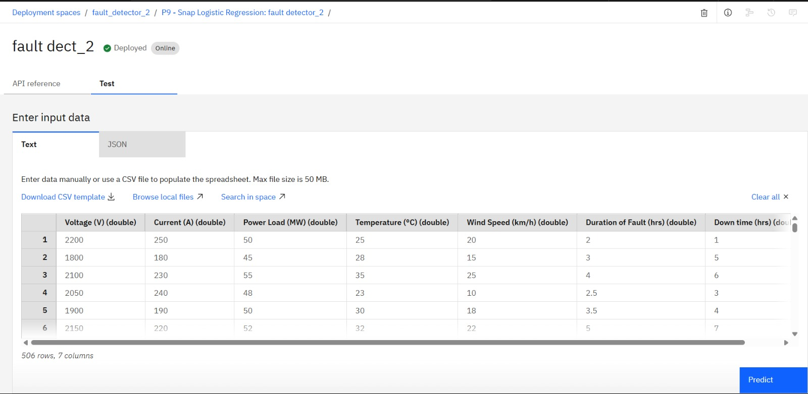
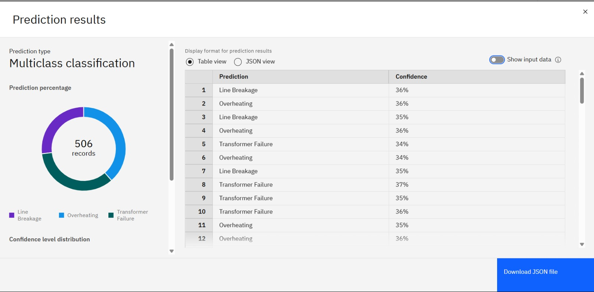

# IBM-Internship

# ⚡ Power System Fault Detection and Classification using Machine Learning

This project implements a machine learning-based system to automatically detect and classify faults in an electrical power distribution network using real-world voltage and current data. Built using **IBM Watson Studio (AutoAI)** and deployed on **IBM Cloud Lite**, the model classifies different fault types in a no-code, cloud-native workflow.

---

## 🔍 Problem Statement

Faults like Line-to-Ground (LG), Line-to-Line (LL), Double Line-to-Ground (LLG), and Three-phase (LLL) can disrupt the stability of power systems. Manual detection is slow and not scalable for modern grids. This project aims to build an intelligent system that automates fault classification using ML models trained on electrical measurement data.

---

## 📊 Dataset

- **Source**: [Kaggle - Power System Faults Dataset](https://www.kaggle.com/datasets/ziya07/power-system-faults-dataset)  
- **Data**: Voltage and current phasors under various fault and normal conditions  
- **Format**: CSV

---

## 🧠 Key Features

- Built using IBM Watson Studio (AutoAI/SPSS Modeler – No coding required)  
- Deployable ML model with real-time prediction capabilities   
- Visual outputs: Confusion Matrix, Accuracy Leaderboard, Model Comparison

---

## 🛠️ Tools & Technologies

| Tool | Description |
|------|-------------|
| **IBM Watson Studio** | Drag-and-drop ML model building |
| **IBM Cloud Lite** | Free-tier deployment platform |
| **AutoAI / SPSS Modeler** | No-code model training and testing |
| **Kaggle Dataset** | Real-world training data for fault classification |

---

## 🚀 Model Development & Deployment

1. Upload dataset to IBM Watson Studio project.
2. Use **AutoAI** to perform:
   - Data preprocessing
   - Model selection (Random Forest chosen based on accuracy)
   - Automatic evaluation
3. Deploy best-performing model to **Watson Machine Learning**.

---

## ✅ Results

- **Best Model**: Random Forest Classifier   
- **Model Outputs**:  
  - Fault type classification (LG, LL, LLG, LLL, No Fault)  
  - Confusion Matrix and performance metrics  
  - Feature importance visualized

### 📷 Sample Screenshots


- 
- 

---

## 📁 Repository Structure

```bash
├── data/
│   └── fault_data.csv
├── screenshots/
│   ├── inserted_data.png
│   └── predicted_output.png
├── Harshil_IBM_Project.pdf
└── README.md

